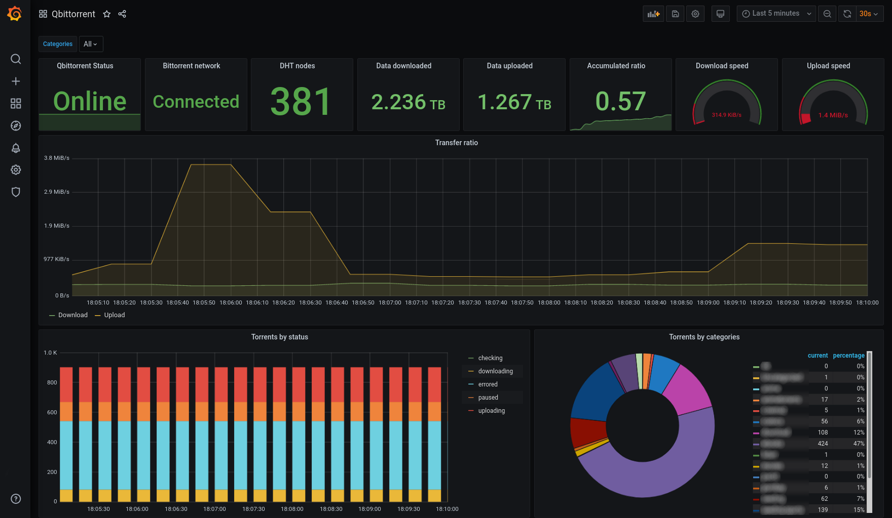

# Prometheus qBittorrent exporter

A prometheus exporter for qBitorrent. Get metrics from a server and offers them in a prometheus format.

## How to use it

```yml
- job_name: "qbittorrent_exporter"
  static_configs:
    - targets: ["yourqbittorrentexporter:port"]
```

The application reads configuration using environment variables:

| Environment variable | Default                 | Description                      |
| -------------------- | ----------------------- | -------------------------------- |
| `QBITTORRENT_ADDR`   | `http://localhost:8080` | qbittorrent server hostname      |
| `QBITTORRENT_USER`   | `""`                    | qbittorrent username             |
| `QBITTORRENT_PASS`   | `""`                    | qbittorrent password             |
| `EXPORTER_PORT`      | `9177`                  | Exporter listening port          |
| `METRICS_PREFIX`     | `qbittorrent`           | Prefix to add to all the metrics |

## Metrics

These are the metrics this program exports, assuming the `METRICS_PREFIX` is `qbittorrent`:

| Metric name                  | Type    | Description                                                                                                                        |
| ---------------------------- | ------- | ---------------------------------------------------------------------------------------------------------------------------------- |
| `qbittorrent_up`             | gauge   | Whether if the qBittorrent server is answering requests from this exporter. A `version` label with the server version is added     |
| `qbittorrent_connected`      | gauge   | Whether if the qBittorrent server is connected to the Bittorrent network.                                                          |
| `qbittorrent_firewalled`     | gauge   | Whether if the qBittorrent server is connected to the Bittorrent network but is behind a firewall.                                 |
| `qbittorrent_dht_nodes`      | gauge   | Number of DHT nodes connected to                                                                                                   |
| `qbittorrent_dl_info_data`   | counter | Data downloaded since the server started, in bytes                                                                                 |
| `qbittorrent_up_info_data`   | counter | Data uploaded since the server started, in bytes                                                                                   |
| `qbittorrent_torrents_count` | gauge   | Number of torrents for each `category` and `status`. Example: `qbittorrent_torrents_count{category="movies",status="downloading"}` |

## Screenshot



[More info](./grafana/README.md)

## License

This software is released under the [GPLv3 license](LICENSE).
